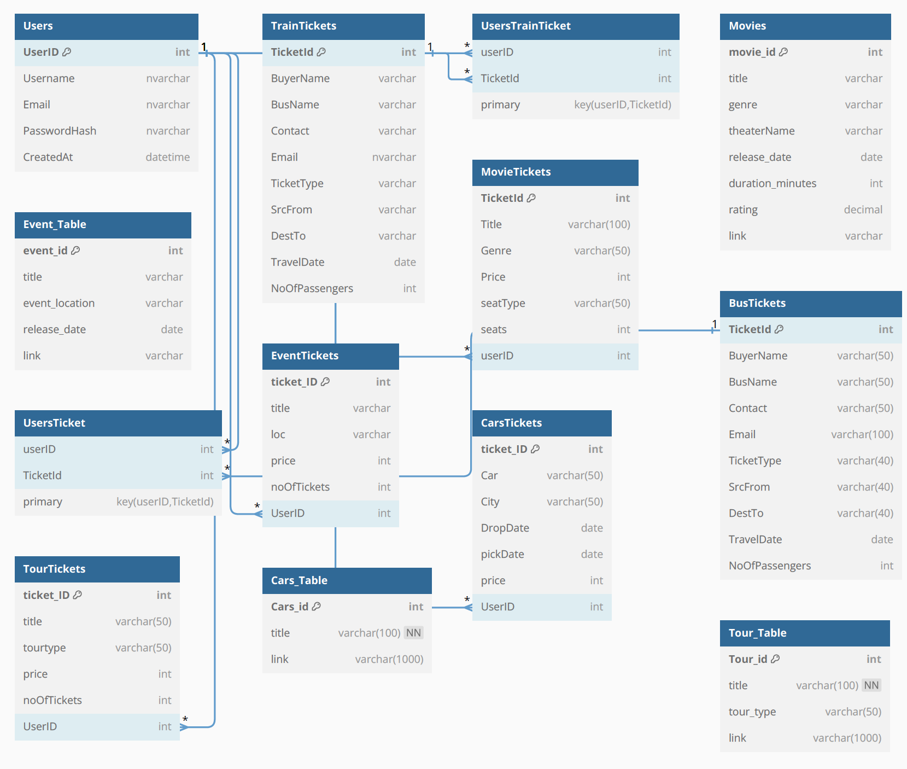

# Ticket Management System
A dynamic booking system for airline, movie, train, and car tickets with data management logic

## Introduction  
The Ticket Management System aims to streamline the process of handling and tracking tickets for various events, issues, or requests within an organization. It will provide functionalities for creating, updating, searching, and deleting tickets, along with filtering options for efficient management  

## Functionalities
1. **User Authentication**  
   Implement a login system for authorized users to access the ticket management system
   
2. **Ticket Creation**  
   Allow users to create new tickets by providing necessary details such as title, description, priority, category, and assigned agent

3. **Ticket Updation**  
   Enable users to update ticket details including status, priority, assigned agent, and additional comments

4. **Ticket Deletion**  
   Allow users to delete tickets when they are no longer relevant or needed

5. **Search by Ticket ID OR Title**  
   Implement a search functionality where users can search for tickets by their unique ID, based on their titles for quick access

6. **Search by Category**  
   Enable users to filter tickets based on their categories (e.g., technical, billing, general inquiries)

7. **Search by Priority**  
   Implement a filtering option to search for tickets based on their priority levels (e.g., low, medium, high, urgent)

8. **View Ticket History**  
   Allow users to view the history of ticket updates, including timestamps and user comments

9. **Ticket Notifications**  
    Implement a notification system to alert users about updates or changes to their assigned tickets

10. **Dashboard Overview**  
    Create a dashboard for users to get an overview of open tickets, resolved tickets, and pending tickets

11. **Mobile Accessibility**  
    Develop a mobile-responsive interface or dedicated mobile app for accessing the ticket management system on the go, enhancing accessibility and convenience for users

12. **Customizable Dashboard Widgets**  
    Allow users to customize their dashboard with widgets displaying metrics, charts, or ticket summaries based on their preferences and priorities

13. **Ticket Duplication Detection**  
    Incorporate functionality to detect and prevent the creation of duplicate tickets, reducing redundancy and streamlining ticket management

## Database Diagram

